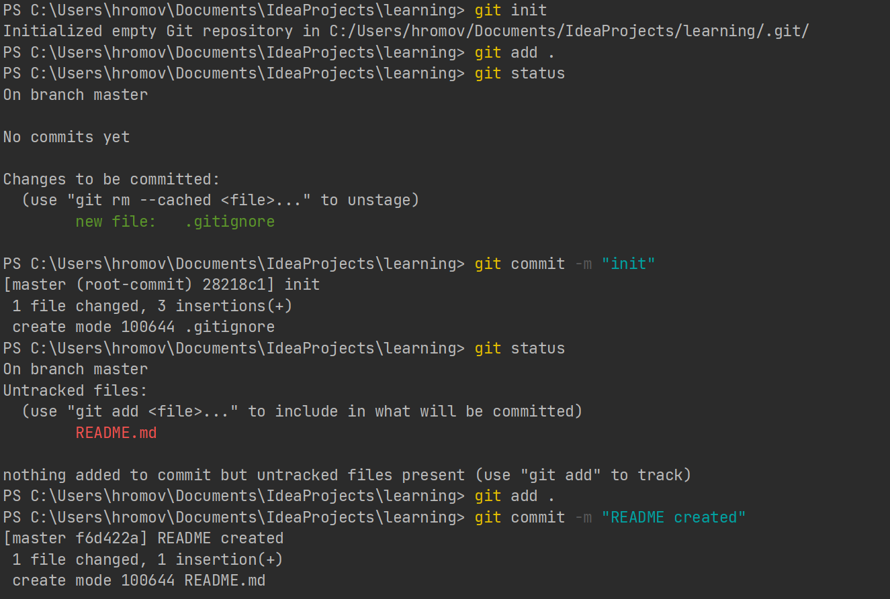
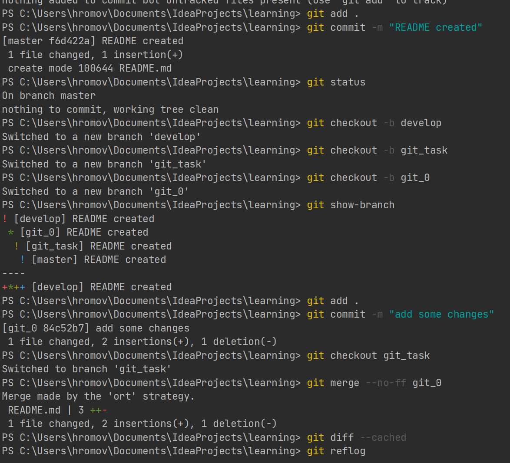
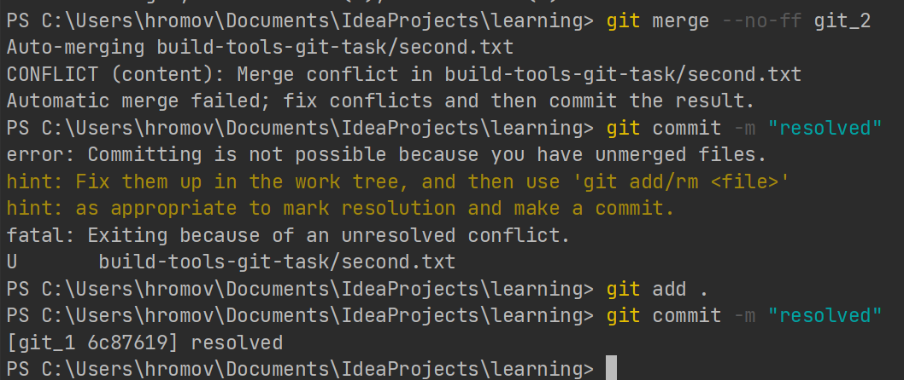
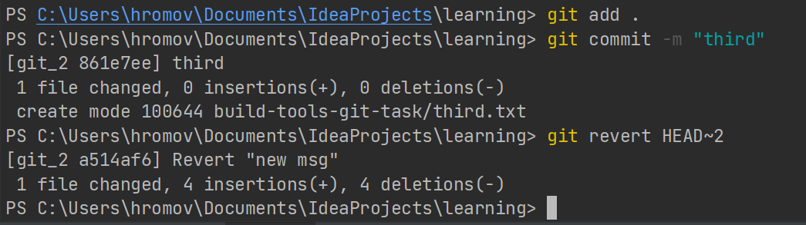

Task 1

Task 2
git_1: Add and commit firstFile.txt file with 10 lines.

git_1: Add and commit secondFile.txt file with 10 lines.

merge branch git_1 to git_2

git_2: Update and commit any two lines in secondFile.txt.

git_1: Update and commit the same 2 lines with the different info in secondFile.txt

merge branch git_2 to git_1, resolve conflict. Left all (4) modified lines. Commit.

git_1: Update and commit firstFile.txt file, modify two lines.

git_1: Update and commit firstFile.txt file, modify another two lines.

Transfer changes of commit from Step 7 only to git_2, using format patch.

Transfer changes of commit from Step 8 only to git_2, using cherrypick command.

git_2: Concatenate the last two commits using reset + commit commands.

git_2: Change date, author and message of the last commit and add non-empty thirdFile.txt file to it.

git_2: Create a new commit that reverts changes of the last one.

git_2: Create and commit thirdFile.txt file.
git_2: Run command that removes all changes of the last two commits.

Synchronize git_1 and git_2 with a remote repository.

